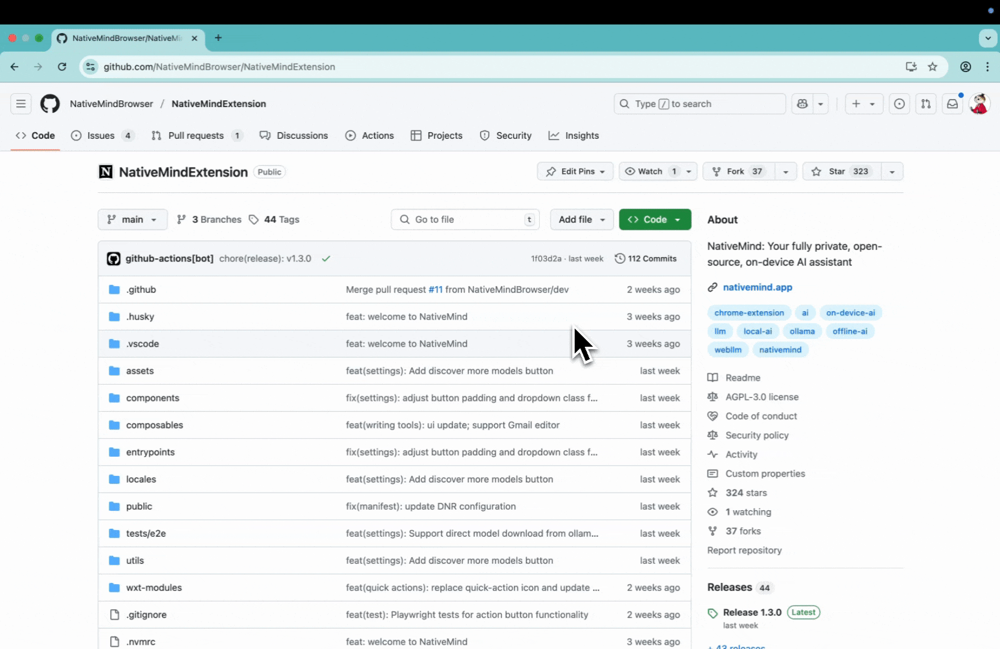
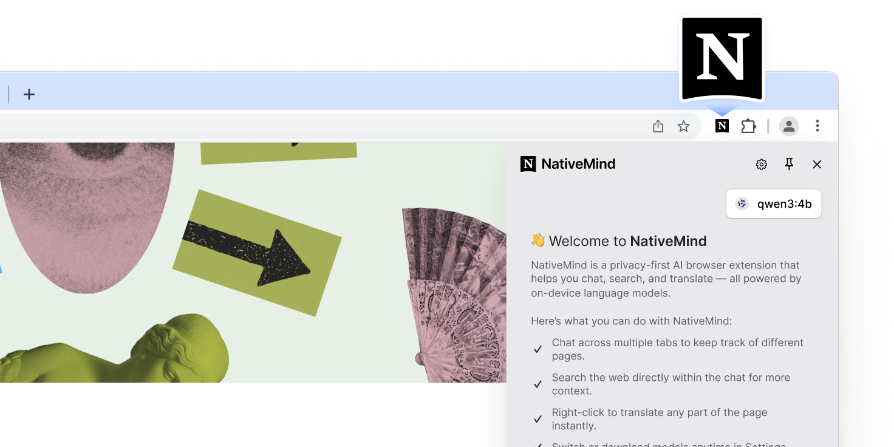

<div align="center">

<h1 align="center">
  <a href="https://nativemind.app" style="text-decoration: none; color: inherit;">NativeMind</a><br>
  Private, On-device Al Assistant
</h1>


*NativeMind is a private, open-source alternative to ChatGPT — a fully local browser extension built on Ollama that brings local AI models into your workflow.*

[](https://chromewebstore.google.com/detail/nativemind-private-on-dev/mgchaojnijgpemdfhpnbeejnppigfllj)
[]()
[]()
[](https://nativemind.app)
[](https://discord.gg/b8p54DKhha)
[](https://x.com/NativeMindApp)

[]()
[]()
[]()
[](https://www.gnu.org/licenses/agpl-3.0)
[](https://github.com/ollama/ollama)
[](https://github.com/mlc-ai/web-llm)

---
**The Future of Private AI is Here, Running Entirely on Your Device**

*NativeMind delivers cutting-edge intelligence without cloud dependencies—**faster responses, zero tracking, unlimited usage**—all running quietly in your browser while you stay in **complete** control.*

</div>

## ⭐ Getting Started & Stay Updated

Star this project to get all the latest updates — you'll never miss a new release!

<div align="center">

</div>

## ✨ Core Features

<div align="center">
  
</div>

### 💬 **Browse Smarter with Local AI**

- **Contextual Awareness Across Tabs**: Seamlessly continue AI conversations with memory that spans across tabs  
- **AI-Powered Local Search**: Ask questions and search the web directly from your browser—no third-party APIs required  
- **Smart Page Understanding**: Instantly summarize and interpret any webpage content  
- **Bilingual Translation**: Translate full pages or selected text with side-by-side view (supports multiple languages)  
- **Quick Prompts**: Save and trigger your frequently used prompts with a single click  

### ✍️ **Boost Productivity with AI Tools**
- **Writing Enhancement**: Rewrite, proofread, and creatively rephrase content with intelligent suggestions  
- **Custom Prompts for Any Task**: Adapt system prompts to match your workflow and local model capabilities  
- **Chat with PDFs** *(coming soon)*: Ask questions directly about local PDF files  
- **Chat with Images** *(coming soon)*: Understand and interact with visual content, including screenshots and uploaded images  

### 🧠 **Run Your Own AI Models Locally**
- **Offline-First**: Use all features without an internet connection after downloading a model—your data stays on your device  
- **Model Switching**: Easily switch between models based on performance, speed, or privacy needs  


## 📦 Installation

NativeMind currently supports **Chromium-based browsers** such as **Chrome**, **Brave**, and **Edge**. Firefox support is coming soon.
  
<a href="https://chromewebstore.google.com/detail/nativemind-your-fully-pri/mgchaojnijgpemdfhpnbeejnppigfllj" target="_blank">
  
</a>


## 🚀 Quick Start

### ⚡ First-Time Setup

<div align="center">



<br>
<em>For more details, visit our official website: <strong><a href="https://nativemind.app/?utm_source=github">nativemind.app</a></strong></em>
</div>

1. **Pin the Extension**: Click the extension icon and pin it to your toolbar
2. **Setup Ollama**: Follow the [Ollama Setup Guide](https://nativemind.app/blog/tutorial/ollama-setup?utm_source=github) for full AI capabilities
3. **Start Using**: Click the NativeMind icon in your browser toolbar

## 🤖 AI Model Options

### 🦙 **[Ollama](https://github.com/ollama/ollama) (Recommended)**
- **Advanced Models**: Deepseek, Qwen, Llama, Gemma, Mistral, Phi and more
- **Superior Performance**: Leverage full system resources
- **Model Flexibility**: Download and switch between specialized models
- **Local Server**: Self-hosted for maximum control

### ⚡ **[WebLLM](https://github.com/mlc-ai/web-llm) (Quick Trial)**
- **Instant Demo**: Try AI capabilities immediately with Qwen3-0.6B in your browser
- **Zero Setup**: No additional software installation required for quick testing
- **WebAssembly-Powered**: Runs directly in browser using WebAssembly
- **Trial Experience**: Perfect for evaluating the extension before setting up Ollama

## 🔮 Why On-Device AI？

### ⚠️ **The Problem with Cloud AI**
In an era where every keystroke can be monitored and every document potentially analyzed, **cloud-based AI services represent a fundamental privacy risk**. Your sensitive data—personal documents, business communications, creative work—becomes part of someone else's training data or surveillance apparatus.

### 🚀 **Performance Revolution**
**Privacy no longer means compromise.** Recent breakthroughs in model efficiency mean on-device AI now **outperforms cloud alternatives**:

- **Qwen3-4B**: Outperforms Qwen2.5-72B while being 18x smaller
- **Gemma3-4B**: Matches Gemma2-27B performance with 6.75x fewer parameters and exceptional image recognition capabilities
- **Phi-4**: Outperforms Gemini Pro 1.5 in mathematical reasoning and competition problems
- **Zero Latency**: No network delays mean instant responses
- **Always Available**: No API limits, rate limiting, or service outages

### 🔒 **True Data Sovereignty**
**NativeMind puts you back in control.** By running AI models entirely on your device, we eliminate the fundamental privacy risks of cloud AI:

- **100% On-Device Processing**: Every keystroke, every document, every conversation stays on your device
- **Zero Cloud Dependencies**: No data ever transmitted to external servers
- **No Corporate Surveillance**: No tech giant can analyze your usage patterns or content
- **No Government Access**: No backdoors or potential government data requests
- **No Data Breaches**: If your data never leaves your device, it can't be stolen from servers
- **No Account Required**: Use all features without registration or login
- **Open Source Transparency**: Every line of code is publicly auditable

## 🧩 How Does NativeMind Compare?

Wondering how NativeMind compares to ChatGPT or Ollama?
Here’s a quick breakdown to help you see where it stands — and when it might be the better choice.

| Feature / Tool            | **NativeMind**                                                  | **ChatGPT**                                 | **Ollama**                                        |
|---------------------------|------------------------------------------------------------------|----------------------------------------------|--------------------------------------------------|
| **Run Mode**              | Browser extension using local models                            | Cloud-based service                           | Local CLI for running models                     |
| **Open Source**           | ✅ Yes                                                           | ❌ No                                          | ✅ Yes                                           |
| **Offline Capable**       | ✅ Yes (all processing is local)                                 | ❌ No                                          | ✅ Yes                                           |
| **Model Source**          | Runs local models via Ollama                                     | Cloud-based language models by OpenAI         | Supports any Ollama-compatible open models       |
| **Use Cases**             | In-Browser AI for Reading, Research, and Productivity            | Chat, Q&A, content generation                | Model serving / backend integration              |
| **Browser Integration**   | ✅ Strong (in-page UI, sidebar, right-click)                     | 🔶 Limited (official / 3rd-party extensions)                                         | ❌ None                                          |
| **Privacy**               | ✅ High — no cloud, no data leaves your device                   | 🔶 Cloud processing; Enterprise offers data controls                          | ✅ High                                          |
| **Installation Complexity** | 🟢 Very low (just install the extension)                         | 🟢 Low (use via website)                     | 🔶 Medium (requires CLI setup)                   
| **Workflow Convenience** | 🟢 In-page actions—no copy-paste | 🔶 Mostly copy-paste between site & page (no built-in plug-in) | 🔶 CLI output—manual copy or custom integration |
## 🛠️ For Developers

### Technology Stack

<table>
<tr>
<td><strong>Frontend</strong></td>
<td>Vue 3 + TypeScript</td>
</tr>
<tr>
<td><strong>Build Tools</strong></td>
<td>WXT (Web Extension Tools) + Vite</td>
</tr>
<tr>
<td><strong>Styling</strong></td>
<td>TailwindCSS</td>
</tr>
<tr>
<td><strong>AI Integration</strong></td>
<td>WebLLM + Ollama + AI SDK</td>
</tr>
<tr>
<td><strong>Package Manager</strong></td>
<td>PNPM</td>
</tr>
</table>

### Prerequisites

- [Node.js](https://nodejs.org/) (v22.14.0 recommended)
- [PNPM](https://pnpm.io/) (v10.10.0 or later)
- Modern browser (Chrome, Firefox, or Edge)

### Installation

1. **Clone the repository**
```bash
git clone https://github.com/NativeMindBrowser/NativeMindExtension.git
cd NativeMindExtension
```

2. **Install dependencies**
```bash
pnpm install
```

3. **Start development server**
```bash
pnpm dev         # Chrome development (default)
pnpm dev:edge    # Edge development
```

### Building for Production

```bash
# Development build
pnpm zip:beta

# Production build  
pnpm zip:prod

```

The built extension will be in the `.output/` directory.

### Manual Installation (Development)
1. **Download**: Get the latest release from [GitHub Releases](https://github.com/NativeMindBrowser/NativeMindExtension/releases)
2. **Install**: Open `chrome://extensions/` → Enable "Developer mode" → Click "Load unpacked"
3. **Setup**: Pin the extension and choose your AI model

## 🔨 Troubleshooting

### Common Issues

**Extension Not Loading**
- Ensure Developer mode is enabled in browser extensions page
- Check that all files were extracted/loaded correctly
- Try refreshing the extensions page and reloading

**AI Models Not Working**
- **WebLLM**: Ensure sufficient RAM (8GB+ recommended) and modern browser
- **Ollama**: Verify Ollama is running locally on port 11434
- Clear browser cache and restart extension
- Check browser console for error messages

**Slow Performance** 
- **WebLLM**: Close other tabs to free up memory
- **Ollama**: Ensure sufficient system resources
- Try smaller AI models for faster response times
- Check if antivirus software is interfering

**Translation/Summarization Not Working**
- Verify AI model is properly loaded
- Check if page has restricted content policies
- Try refreshing the page and retrying
- Ensure page content is selectable text (not images)

### Getting Help
- Check browser console (F12 → Console) for error messages
- Join our Discord community for support: https://discord.gg/b8p54DKhha
- Report issues on [GitHub Issues](https://github.com/NativeMindBrowser/NativeMindExtension/issues)
- Include browser version, OS, and error details in reports

## 🤝 Contributing

<div align="center">

**Contributions are welcome! Help us build the future of private AI.**

[]()
[]()

</div>

### 🚀 Quick Start for Contributors

1. **Fork** the project
2. **Create** your feature branch (`git checkout -b feature/amazing-feature`)
3. **Commit** your changes (`git commit -m 'Add some amazing feature'`)
4. **Push** to the branch (`git push origin feature/amazing-feature`)
5. **Open** a Pull Request

### 📋 Development Guidelines

- ✅ Follow the existing code style
- ✅ Add tests for new functionality  
- ✅ Update documentation as needed
- ✅ Ensure privacy-first principles

## 📄 License

<div align="center">

**GNU Affero General Public License v3.0**

*Ensuring this project remains open source and privacy-focused*

See the [LICENSE](LICENSE) file for complete details.

</div>

## 🙏 Acknowledgments

<div align="center">

*Standing on the shoulders of giants*

</div>

- 👥 **Contributors**: Thanks to all who have helped shape NativeMind
- 🛠️ **[WXT](https://github.com/wxt-dev/wxt)**: Making browser extension development easier
- 🧠 **[WebLLM](https://github.com/mlc-ai/web-llm)**: Enabling in-browser AI capabilities
- 🦙 **[Ollama](https://github.com/ollama/ollama)**: Powering local LLM support

---

<div align="center">

**Made with ❤️ for Privacy and AI Innovation**

*[⭐ Star this project](https://github.com/NativeMindBrowser/NativeMindExtension) if you find it useful!*

</div>
