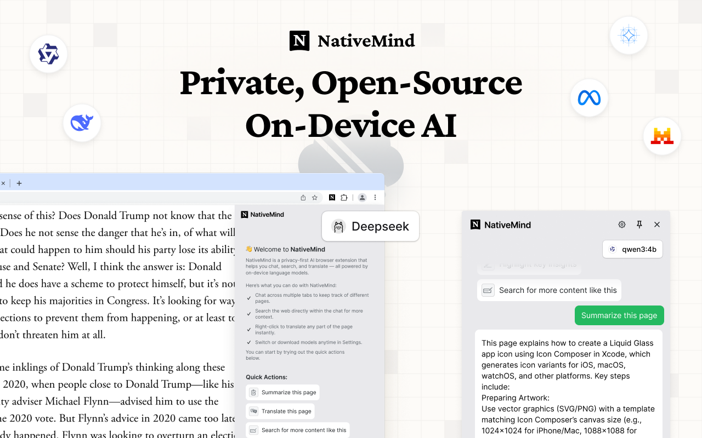

<div align="center">


# NativeMind - Private, on-device AI Assistant, no cloud dependencies

**The Future of Private AI is Here, Running Entirely on Your Device**

*Experience powerful AI capabilities with zero cloud dependencies*



### 🚀 [Visit Official Website](https://nativemind.app/)

[]()
[]()
[]()

[](https://github.com/ollama/ollama)
[](https://github.com/mlc-ai/web-llm)

[](https://chromewebstore.google.com/detail/nativemind-private-on-dev/mgchaojnijgpemdfhpnbeejnppigfllj)
[]()

[](https://discord.gg/b8p54DKhha)
[](https://www.gnu.org/licenses/agpl-3.0)

---

*Finally, **AI that truly belongs to you**. NativeMind delivers cutting-edge intelligence without cloud dependencies—**faster responses, zero tracking, unlimited usage**—all running quietly in your browser while you stay in complete control.*

</div>

## 📦 Quick Start

### 🚀 Installation

Install directly from the [Chrome Web Store](https://chromewebstore.google.com/detail/nativemind-private-on-dev/mgchaojnijgpemdfhpnbeejnppigfllj) for easy installation.

### ⚡ First-Time Setup

1. **Pin the Extension**: Click the extension icon and pin it to your toolbar
2. **Setup Ollama**: Follow the [Ollama Setup Guide](https://nativemind.app/blog/tutorial/ollama-setup) for full AI capabilities
3. **Start Using**: Click the NativeMind icon in your browser toolbar

<div align="center">

<br>
For more details, visit our official website: **[nativemind.app](https://nativemind.app/)**
</div>

## ✨ Core Features

### 🤖 **Private AI Assistant**
- **Intelligent Conversations**: Multi-tab context awareness for comprehensive AI discussions
- **Smart Content Analysis**: Instant webpage summaries and document understanding
- **Universal Translation**: Full-page translation with bilingual side-by-side view and selected text translation
- **AI-Powered Search**: Enhanced web search capabilities directly through your browser
- **Writing Enhancement**: Auto-detection with intelligent rewriting, proofreading, and creative suggestions
- **Real-time Assistance**: Floating toolbar appears contextually across all websites

### ⚡ **AI Model Integration**
- **Offline-First Design**: Full functionality without internet connection (after model download)
- **Model Flexibility**: Switch between models based on your performance and privacy needs

### 🌐 **Universal Compatibility**
- **Cross-Browser Support**: Native integration with Chrome and Edge
- **Cross-Platform**: Works on Windows, macOS, and Linux

## 🤖 AI Model Options

### 🦙 **[Ollama](https://github.com/ollama/ollama) (Recommended)**
- **Advanced Models**: Deepseek, Qwen, Llama, Gemma, Mistral, Phi and more
- **Superior Performance**: Leverage full system resources
- **Model Flexibility**: Download and switch between specialized models
- **Local Server**: Self-hosted for maximum control

### ⚡ **[WebLLM](https://github.com/mlc-ai/web-llm) (Quick Trial)**
- **Instant Demo**: Try AI capabilities immediately with Qwen3-0.6B in your browser
- **Zero Setup**: No additional software installation required for quick testing
- **WebAssembly-Powered**: Runs directly in browser using WebAssembly
- **Trial Experience**: Perfect for evaluating the extension before setting up Ollama

> 💡 **Build Your Personal AI Assistant**: Combine NativeMind with [Ollama](https://github.com/ollama/ollama) to create a truly private, powerful AI assistant that understands your workflow and protects your data. Try it instantly with [WebLLM](https://github.com/mlc-ai/web-llm) for quick evaluation.

## 🔮 Why On-Device AI is the Future

### The Problem with Cloud AI
In an era where every keystroke can be monitored and every document potentially analyzed, **cloud-based AI services represent a fundamental privacy risk**. Your sensitive data—personal documents, business communications, creative work—becomes part of someone else's training data or surveillance apparatus.

### 🚀 **Performance Revolution**
**Privacy no longer means compromise.** Recent breakthroughs in model efficiency mean on-device AI now **outperforms cloud alternatives**:

- **Qwen3-4B**: Outperforms Qwen2.5-72B while being 18x smaller
- **Gemma3-4B**: Matches Gemma2-27B performance with 6.75x fewer parameters and exceptional image recognition capabilities
- **Phi-4**: Outperforms Gemini Pro 1.5 in mathematical reasoning and competition problems
- **Zero Latency**: No network delays mean instant responses
- **Always Available**: No API limits, rate limiting, or service outages

### 🔒 **True Data Sovereignty**
**NativeMind puts you back in control.** By running AI models entirely on your device, we eliminate the fundamental privacy risks of cloud AI:

- **100% On-Device Processing**: Every keystroke, every document, every conversation stays on your device
- **Zero Cloud Dependencies**: No data ever transmitted to external servers
- **No Corporate Surveillance**: No tech giant can analyze your usage patterns or content
- **No Government Access**: No backdoors or potential government data requests
- **No Data Breaches**: If your data never leaves your device, it can't be stolen from servers
- **No Account Required**: Use all features without registration or login
- **Open Source Transparency**: Every line of code is publicly auditable

## 🛠️ For Developers

### Technology Stack

<table>
<tr>
<td><strong>Frontend</strong></td>
<td>Vue 3 + TypeScript</td>
</tr>
<tr>
<td><strong>Build Tools</strong></td>
<td>WXT (Web Extension Tools) + Vite</td>
</tr>
<tr>
<td><strong>Styling</strong></td>
<td>TailwindCSS</td>
</tr>
<tr>
<td><strong>AI Integration</strong></td>
<td>WebLLM + Ollama + AI SDK</td>
</tr>
<tr>
<td><strong>Package Manager</strong></td>
<td>PNPM</td>
</tr>
</table>

### Prerequisites

- [Node.js](https://nodejs.org/) (v22.14.0 recommended)
- [PNPM](https://pnpm.io/) (v10.10.0 or later)
- Modern browser (Chrome, Firefox, or Edge)

### Installation

1. **Clone the repository**
```bash
git clone https://github.com/NativeMindBrowser/NativeMindExtension.git
cd NativeMindExtension
```

2. **Install dependencies**
```bash
pnpm install
```

3. **Start development server**
```bash
pnpm dev         # Chrome development (default)
pnpm dev:edge    # Edge development
```

### Building for Production

```bash
# Development build
pnpm zip:beta

# Production build  
pnpm zip:prod

```

The built extension will be in the `.output/` directory.

### Manual Installation (Development)
1. **Download**: Get the latest release from [GitHub Releases](https://github.com/NativeMindBrowser/NativeMindExtension/releases)
2. **Install**: Open `chrome://extensions/` → Enable "Developer mode" → Click "Load unpacked"
3. **Setup**: Pin the extension and choose your AI model

## 🛠️ Troubleshooting

### Common Issues

**Extension Not Loading**
- Ensure Developer mode is enabled in browser extensions page
- Check that all files were extracted/loaded correctly
- Try refreshing the extensions page and reloading

**AI Models Not Working**
- **WebLLM**: Ensure sufficient RAM (8GB+ recommended) and modern browser
- **Ollama**: Verify Ollama is running locally on port 11434
- Clear browser cache and restart extension
- Check browser console for error messages

**Slow Performance** 
- **WebLLM**: Close other tabs to free up memory
- **Ollama**: Ensure sufficient system resources
- Try smaller AI models for faster response times
- Check if antivirus software is interfering

**Translation/Summarization Not Working**
- Verify AI model is properly loaded
- Check if page has restricted content policies
- Try refreshing the page and retrying
- Ensure page content is selectable text (not images)

### Getting Help
- Check browser console (F12 → Console) for error messages
- Join our Discord community for support: https://discord.gg/b8p54DKhha
- Report issues on [GitHub Issues](https://github.com/NativeMindBrowser/NativeMindExtension/issues)
- Include browser version, OS, and error details in reports

## 🤝 Contributing

<div align="center">

**Contributions are welcome! Help us build the future of private AI.**

[]()
[]()

</div>

### 🚀 Quick Start for Contributors

1. **Fork** the project
2. **Create** your feature branch (`git checkout -b feature/amazing-feature`)
3. **Commit** your changes (`git commit -m 'Add some amazing feature'`)
4. **Push** to the branch (`git push origin feature/amazing-feature`)
5. **Open** a Pull Request

### 📋 Development Guidelines

- ✅ Follow the existing code style
- ✅ Add tests for new functionality  
- ✅ Update documentation as needed
- ✅ Ensure privacy-first principles

## 📄 License

<div align="center">

**GNU Affero General Public License v3.0**

*Ensuring this project remains open source and privacy-focused*

See the [LICENSE](LICENSE) file for complete details.

</div>

## 🙏 Acknowledgments

<div align="center">

*Standing on the shoulders of giants*

</div>

- 👥 **Contributors**: Thanks to all who have helped shape NativeMind
- 🛠️ **[WXT](https://github.com/wxt-dev/wxt)**: Making browser extension development easier
- 🧠 **[WebLLM](https://github.com/mlc-ai/web-llm)**: Enabling in-browser AI capabilities
- 🦙 **[Ollama](https://github.com/ollama/ollama)**: Powering local LLM support

---

<div align="center">

**Made with ❤️ for Privacy and AI Innovation**

*[⭐ Star this project](https://github.com/NativeMindBrowser/NativeMindExtension) if you find it useful!*

</div>
